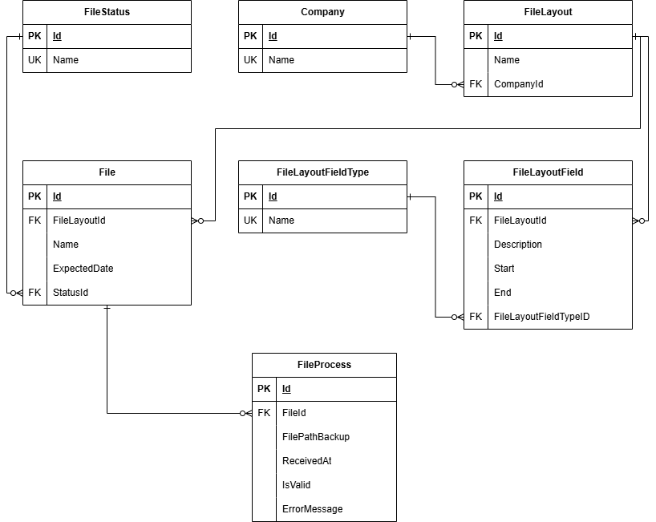

<h1 align="center">
    File Reception API
</h1>

## Descrição do projeto
O projeto consiste em uma aplicação ASP.NET Core 8 para o monitoramento da recepção de arquivos enviados pelas adquirentes.
O sistema automatiza o registro de arquivos financeiros, permitindo que a equipe operacional acompanhe em tempo real os arquivos recepcionados.
A aplicação verifica os arquivos cadastrados na tabela File com status "Não Recepcionado",e, quando um arquivo esperado é enviado, esse é processado e um registro é criado na tabela FileProcess, atualizando o status do arquivo para:
- Recepcionado →‬ Arquivo processado com sucesso.
- Erro →‬ Arquivo processado com falha.<br/>
<h3 align="center">
    <a href="https://dotnet.microsoft.com/en-us/apps/aspnet">🔗 ASP.NET Core</a>
</h3>
<p align="center">🚀 Framework de desenvolvimento multiplataforma, moderno e robusto.</p>
<br/>
<h4>
    
    
    
    
    
    
    
</h4>

---

## Status do projeto
#### ✅ Released
---

## Índice
<ul>
  <li><a href="#descrição-do-projeto">Descrição do projeto</a></li>
  <li><a href="#status-do-projeto">Status do projeto</a></li>
  <li><a href="#recursos">Recursos</a></li>
  <li><a href="#pré-requisitos">Pré-requisitos</a></li>
  <li><a href="#execução">Execução</a></li>
  <li><a href="#testes">Testes</a></li>
  <li><a href="#diagrama-de-entidades">Diagrama de Entidades</a></li>
  <li><a href="#rotas">Rotas</a></li>
  <li><a href="#tecnologias">Tecnologias</a></li>
  <li><a href="#autora">Autora</a></li>
</ul> 

---

## Recursos
- [x] Monitoramento da recepção de arquivos.
- [x] Registro de arquivos processados.
- [x] Atualização de status de arquivos (Recepcionado, Não Recepcionado, Erro).
- [x] Suporte a backup de arquivos locais.

---

## Pré-requisitos
Para executar a aplicação localmente, as seguintes ferramentas deverão estar instaladas na máquina:
- [Git](https://git-scm.com/install/)
- [.NET 8 SDK](https://dotnet.microsoft.com/pt-br/download/dotnet/8.0)
- [Visual Studio ou Visual Studio Code](https://visualstudio.microsoft.com/pt-br/downloads/)
- [SQL Server](https://www.microsoft.com/pt-br/sql-server/sql-server-downloads) (local ou via Docker)
- [Redis](https://redis.io/downloads/) (necessário apenas se não usar Docker)

---

## Execução
Primeiramente, clone o repositório abaixo:
```bash
$ git clone https://github.com/AndressaCarvalho/file-reception-api.git
```
### 1️⃣ Executando localmente
1. No appsettings.json, configure o diretório para o backup de arquivos:
```json
{
  "FileConfig": {
    "BackupPath": "C:\\www\\exemplo"
  }
}
```
2. Execute os comandos:
```bash
dotnet build
dotnet run
```
> ⚠️ Sem o Docker, será necessário executar um container do Redis na porta 6379, executando o comando `docker run -d --name redis -p 6379:6379 redis` antes de rodar a aplicação.

### 2️⃣ Executando via Docker
1. Certifique-se de ter [Docker](https://docs.docker.com/engine/install/) instalado e em execução.
2. Execute o comando:
```bash
docker-compose up --build -d
```
> ✅ O banco de dados SQL Server e o Redis já serão criados pelo Docker.

> Para parar a execução e remover o container, execute `docker-compose down`.

**A aplicação deve ser executada no endereço [https://localhost:7006](https://localhost:7006/).**

---

## Testes
Para que a aplicação seja testada, é necessário a população do banco de dados SQL Server. Sendo assim, no diretório /DataSeeding existem:

### scripts.sql
Contém querys que podem ser usadas para inserir registros diretamente no banco de dados.

### endpoints.txt
Se preferir, os dados podem ser cadastrados através de requisições POST à API, descritas no arquivo.

### /TestFiles
Apresenta arquivos que podem ser usados para o upload.

> ⚠️ As tabelas FileStatus e FileLayoutFieldType já são populadas por meio da Migration.

---

## Diagrama de Entidades
Representação das tabelas e seus relacionamentos no banco de dados:


---

## Rotas
### GET /api/Company
Retorna todos os adquirentes (lista).

**Response**
|          Nome |  Tipo   | Descrição                                                                                                                                                           |
| -------------:|:-------:| --------------------------------------------------------------------------------------------------------------------------------------------------------------------- |
|     `id` | integer  | Identificador do adquirente.|
|     `name` | string  | Nome do adquirente.|

### GET /api/Company/{id}
Retorna um adquirente pelo seu código.

**URL parameters**
|          Nome | Obrigatoriedade |  Tipo   | Descrição                                                                                                                                                           |
| -------------:|:--------:|:-------:| --------------------------------------------------------------------------------------------------------------------------------------------------------------------- |
|     `id` | obrigatório | integer  | Identificador do adquirente.|                                                                     

**Response**
|          Nome |  Tipo   | Descrição                                                                                                                                                           |
| -------------:|:-------:| --------------------------------------------------------------------------------------------------------------------------------------------------------------------- |
|     `id` | integer  | Identificador do adquirente.|
|     `name` | string  | Nome do adquirente.|

### POST /api/Company
Cria um novo adquirente.

**Request body**
|          Nome | Obrigatoriedade |  Tipo   | Descrição                                                                                                                                                           |
| -------------:|:--------:|:-------:| --------------------------------------------------------------------------------------------------------------------------------------------------------------------- |
|     `name` | obrigatório | string  | Nome do adquirente.|                                                                     

**Response**
|          Nome |  Tipo   | Descrição                                                                                                                                                           |
| -------------:|:-------:| --------------------------------------------------------------------------------------------------------------------------------------------------------------------- |
|     `id` | integer  | Identificador do adquirente.|
|     `name` | string  | Nome do adquirente.|

### GET /api/FileStatus
Retorna todos os status dos arquivos (lista).

**Response**
|          Nome |  Tipo   | Descrição                                                                                                                                                           |
| -------------:|:-------:| --------------------------------------------------------------------------------------------------------------------------------------------------------------------- |
|     `id` | integer  | Identificador do status.|
|     `name` | string  | Nome do status.|

### GET /api/FileStatus/{id}
Retorna um status pelo seu código.

**URL parameters**
|          Nome | Obrigatoriedade |  Tipo   | Descrição                                                                                                                                                           |
| -------------:|:--------:|:-------:| --------------------------------------------------------------------------------------------------------------------------------------------------------------------- |
|     `id` | obrigatório | integer  | Identificador do status.|                                                                     

**Response**
|          Nome |  Tipo   | Descrição                                                                                                                                                           |
| -------------:|:-------:| --------------------------------------------------------------------------------------------------------------------------------------------------------------------- |
|     `id` | integer  | Identificador do status.|
|     `name` | string  | Nome do status.|

### POST /api/FileStatus
Cria um novo status.

**Request body**
|          Nome | Obrigatoriedade |  Tipo   | Descrição                                                                                                                                                           |
| -------------:|:--------:|:-------:| --------------------------------------------------------------------------------------------------------------------------------------------------------------------- |
|     `name` | obrigatório | string  | Nome do status.|                                                                     

**Response**
|          Nome |  Tipo   | Descrição                                                                                                                                                           |
| -------------:|:-------:| --------------------------------------------------------------------------------------------------------------------------------------------------------------------- |
|     `id` | integer  | Identificador do status.|
|     `name` | string  | Nome do status.|

### GET /api/FileLayoutFieldType
Retorna todos os tipos de campos do layout (lista).

**Response**
|          Nome |  Tipo   | Descrição                                                                                                                                                           |
| -------------:|:-------:| --------------------------------------------------------------------------------------------------------------------------------------------------------------------- |
|     `id` | integer  | Identificador do tipo.|
|     `name` | string  | Nome do tipo.|

### GET /api/FileLayoutFieldType/{id}
Retorna um tipo pelo seu código.

**URL parameters**
|          Nome | Obrigatoriedade |  Tipo   | Descrição                                                                                                                                                           |
| -------------:|:--------:|:-------:| --------------------------------------------------------------------------------------------------------------------------------------------------------------------- |
|     `id` | obrigatório | integer  | Identificador do tipo.|                                                                     

**Response**
|          Nome |  Tipo   | Descrição                                                                                                                                                           |
| -------------:|:-------:| --------------------------------------------------------------------------------------------------------------------------------------------------------------------- |
|     `id` | integer  | Identificador do tipo.|
|     `name` | string  | Nome do tipo.|

### POST /api/FileLayoutFieldType
Cria um novo tipo.

**Request body**
|          Nome | Obrigatoriedade |  Tipo   | Descrição                                                                                                                                                           |
| -------------:|:--------:|:-------:| --------------------------------------------------------------------------------------------------------------------------------------------------------------------- |
|     `name` | obrigatório | string  | Nome do tipo.|                                                                     

**Response**
|          Nome |  Tipo   | Descrição                                                                                                                                                           |
| -------------:|:-------:| --------------------------------------------------------------------------------------------------------------------------------------------------------------------- |
|     `id` | integer  | Identificador do tipo.|
|     `name` | string  | Nome do tipo.|

### GET /api/FileLayout
Retorna todos os layouts (lista).

**Response**
|          Nome |  Tipo   | Descrição                                                                                                                                                           |
| -------------:|:-------:| --------------------------------------------------------------------------------------------------------------------------------------------------------------------- |
|     `id` | integer  | Identificador do layout.|
|     `fileLayoutName` | string  | Nome do layout.|
|     `companyId` | integer  | Identificador do adquirente.|
|     `companyName` | string  | Nome do adquirente.|

### GET /api/FileLayout/{id}
Retorna um layout pelo seu código.

**URL parameters**
|          Nome | Obrigatoriedade |  Tipo   | Descrição                                                                                                                                                           |
| -------------:|:--------:|:-------:| --------------------------------------------------------------------------------------------------------------------------------------------------------------------- |
|     `id` | obrigatório | integer  | Identificador do layout.|                                                                     

**Response**
|          Nome |  Tipo   | Descrição                                                                                                                                                           |
| -------------:|:-------:| --------------------------------------------------------------------------------------------------------------------------------------------------------------------- |
|     `id` | integer  | Identificador do layout.|
|     `fileLayoutName` | string  | Nome do layout.|
|     `companyId` | integer  | Identificador do adquirente.|
|     `companyName` | string  | Nome do adquirente.|
</br>

### POST /api/FileLayout
Cria um novo layout.

**Request body**
|          Nome | Obrigatoriedade |  Tipo   | Descrição                                                                                                                                                           |
| -------------:|:--------:|:-------:| --------------------------------------------------------------------------------------------------------------------------------------------------------------------- |
|     `name` | obrigatório | string  | Nome do layout.|                                                                     
|     `comapanyId` | obrigatório | integer  | Identificador do adquirente.|                                                                     

**Response**
|          Nome |  Tipo   | Descrição                                                                                                                                                           |
| -------------:|:-------:| --------------------------------------------------------------------------------------------------------------------------------------------------------------------- |
|     `id` | integer  | Identificador do layout.|
|     `fileLayoutName` | string  | Nome do layout.|
|     `companyId` | integer  | Identificador do adquirente.|
|     `companyName` | string  | Nome do adquirente.|

### GET /api/FileLayoutField
Retorna todos os campos dos layouts (lista).

**Response**
|          Nome |  Tipo   | Descrição                                                                                                                                                           |
| -------------:|:-------:| --------------------------------------------------------------------------------------------------------------------------------------------------------------------- |
|     `id` | integer  | Identificador do campo.|
|     `fileLayoutId` | integer  | Identificador do layout.|
|     `fileLayoutName` | string  | Nome do layout.|
|     `description` | string  | Descrição do campo.|
|     `start` | integer  | Início do campo.|
|     `end` | integer  | Fim do campo.|
|     `fileLayoutFieldTypeId` | integer  | Identificador do tipo do campo.|
|     `fileLayoutFieldTypeName` | string  | Nome do tipo do campo.|
</br>

### GET /api/FileLayoutField/{id}
Retorna um campo pelo seu código.

**URL parameters**
|          Nome | Obrigatoriedade |  Tipo   | Descrição                                                                                                                                                           |
| -------------:|:--------:|:-------:| --------------------------------------------------------------------------------------------------------------------------------------------------------------------- |
|     `id` | obrigatório | integer  | Identificador do campo.|                                                                     

**Response**
|          Nome |  Tipo   | Descrição                                                                                                                                                           |
| -------------:|:-------:| --------------------------------------------------------------------------------------------------------------------------------------------------------------------- |
|     `id` | integer  | Identificador do campo.|
|     `fileLayoutId` | integer  | Identificador do layout.|
|     `fileLayoutName` | string  | Nome do layout.|
|     `description` | string  | Descrição do campo.|
|     `start` | integer  | Início do campo.|
|     `end` | integer  | Fim do campo.|
|     `fileLayoutFieldTypeId` | integer  | Identificador do tipo do campo.|
|     `fileLayoutFieldTypeName` | string  | Nome do tipo do campo.|

### POST /api/FileLayoutField
Cria um novo campo.

**Request body**
|          Nome | Obrigatoriedade |  Tipo   | Descrição                                                                                                                                                           |
| -------------:|:--------:|:-------:| --------------------------------------------------------------------------------------------------------------------------------------------------------------------- |
|     `fileLayoutId` | obrigatório | integer  | Identificador do layout.| 
|     `description` | obrigatório | string  | Descrição do campo.|                                                                     
|     `start` | obrigatório | integer  | Início do campo.| 
|     `end` | obrigatório | integer  | Fim do campo.| 
|     `fileLayoutFieldTypeId` | obrigatório | integer  | Identificador do tipo do campo.| 

**Response**
|          Nome |  Tipo   | Descrição                                                                                                                                                           |
| -------------:|:-------:| --------------------------------------------------------------------------------------------------------------------------------------------------------------------- |
|     `id` | integer  | Identificador do campo.|
|     `fileLayoutId` | integer  | Identificador do layout.|
|     `fileLayoutName` | string  | Nome do layout.|
|     `description` | string  | Descrição do campo.|
|     `start` | integer  | Início do campo.|
|     `end` | integer  | Fim do campo.|
|     `fileLayoutFieldTypeId` | integer  | Identificador do tipo do campo.|
|     `fileLayoutFieldTypeName` | string  | Nome do tipo do campo.|

### GET /api/File
Retorna todos os arquivos (lista).

**Response**
|          Nome |  Tipo   | Descrição                                                                                                                                                           |
| -------------:|:-------:| --------------------------------------------------------------------------------------------------------------------------------------------------------------------- |
|     `id` | integer  | Identificador do campo.|
|     `fileLayoutId` | integer  | Identificador do layout.|
|     `fileLayoutName` | string  | Nome do layout.|
|     `companyId` | integer  | Identificador do adquirente.|
|     `companyName` | string  | Nome do adquirente.|
|     `fileName` | string  | Nome do arquivo.|
|     `expectedDate` | datetime  | Data esperada do arquivo.|
|     `statusId` | integer  | Identificador do status do arquivo.|
|     `statusName` | string  | Nome do status do arquivo.|

### GET /api/File/{id}
Retorna um arquivo pelo seu código.

**URL parameters**
|          Nome | Obrigatoriedade |  Tipo   | Descrição                                                                                                                                                           |
| -------------:|:--------:|:-------:| --------------------------------------------------------------------------------------------------------------------------------------------------------------------- |
|     `id` | obrigatório | integer  | Identificador do arquivo.|                                                                     

**Response**
|          Nome |  Tipo   | Descrição                                                                                                                                                           |
| -------------:|:-------:| --------------------------------------------------------------------------------------------------------------------------------------------------------------------- |
|     `id` | integer  | Identificador do campo.|
|     `fileLayoutId` | integer  | Identificador do layout.|
|     `fileLayoutName` | string  | Nome do layout.|
|     `companyId` | integer  | Identificador do adquirente.|
|     `companyName` | string  | Nome do adquirente.|
|     `fileName` | string  | Nome do arquivo.|
|     `expectedDate` | datetime  | Data esperada do arquivo.|
|     `statusId` | integer  | Identificador do status do arquivo.|
|     `statusName` | string  | Nome do status do arquivo.|

### GET /api/File/report
Retorna a quantidade de arquivos cadastrados, nos últimos N dias, agrupada pelo status.

**Query parameters**
|          Nome | Obrigatoriedade |  Tipo   | Descrição                                                                                                                                                           |
| -------------:|:--------:|:-------:| --------------------------------------------------------------------------------------------------------------------------------------------------------------------- |
|     `lastDays` | obrigatório | integer  | Número de dias.|                                                                     

**Response**
|          Nome |  Tipo   | Descrição                                                                                                                                                           |
| -------------:|:-------:| --------------------------------------------------------------------------------------------------------------------------------------------------------------------- |
|     `Erro` | integer  | Quantidade de arquivos com erro.|
|     `Não Recepcionado` | integer  | Quantidade de arquivos com não recepcionados.|
|     `Recepcionado` | integer  | Quantidade de arquivos com recepcionados.|

### POST /api/File
Cria um novo arquivo.

**Request body**
|          Nome | Obrigatoriedade |  Tipo   | Descrição                                                                                                                                                           |
| -------------:|:--------:|:-------:| --------------------------------------------------------------------------------------------------------------------------------------------------------------------- |
|     `fileLayoutId` | obrigatório | integer  | Identificador do layout.| 
|     `fileName` | obrigatório | string  | Nome do arquivo.|                                                                     
|     `expectedDate` | opcional (default data atual) | datetime  | Data esperada do arquivo.| 
|     `statusId` | opcional (deafult "Não Recepcionado) | integer  | Identificador do status do arquivo.| 

**Response**
|          Nome |  Tipo   | Descrição                                                                                                                                                           |
| -------------:|:-------:| --------------------------------------------------------------------------------------------------------------------------------------------------------------------- |
|     `id` | integer  | Identificador do campo.|
|     `fileLayoutId` | integer  | Identificador do layout.|
|     `fileLayoutName` | string  | Nome do layout.|
|     `companyId` | integer  | Identificador do adquirente.|
|     `companyName` | string  | Nome do adquirente.|
|     `fileName` | string  | Nome do arquivo.|
|     `expectedDate` | datetime  | Data esperada do arquivo.|
|     `statusId` | integer  | Identificador do status do arquivo.|
|     `statusName` | string  | Nome do status do arquivo.|

### GET /api/FileProcess
Retorna todos os processamentos de arquivos (lista).

**Response**
|          Nome |  Tipo   | Descrição                                                                                                                                                           |
| -------------:|:-------:| --------------------------------------------------------------------------------------------------------------------------------------------------------------------- |
|     `id` | integer  | Identificador do processamento.|
|     `fileId` | integer  | Identificador do arquivo.|
|     `fileName` | string  | Nome do arquivo.|
|     `filePathBackup` | string  | Caminho do backup do arquivo.|
|     `receivedAt` | datetime  | Data do processamento.|
|     `isValid` | boolean  | Estado do arquivo (válido ou inválido).|
|     `errorMessage` | string - null  | Mensagem de erro no processamento.|

### GET /api/FileProcess/{id}
Retorna um processamento pelo seu código.

**URL parameters**
|          Nome | Obrigatoriedade |  Tipo   | Descrição                                                                                                                                                           |
| -------------:|:--------:|:-------:| --------------------------------------------------------------------------------------------------------------------------------------------------------------------- |
|     `id` | obrigatório | integer  | Identificador do processamento.|                                                                     

**Response**
|          Nome |  Tipo   | Descrição                                                                                                                                                           |
| -------------:|:-------:| --------------------------------------------------------------------------------------------------------------------------------------------------------------------- |
|     `id` | integer  | Identificador do processamento.|
|     `fileId` | integer  | Identificador do arquivo.|
|     `fileName` | string  | Nome do arquivo.|
|     `filePathBackup` | string  | Caminho do backup do arquivo.|
|     `receivedAt` | datetime  | Data do processamento.|
|     `isValid` | boolean  | Estado do arquivo (válido ou inválido).|
|     `errorMessage` | string - null  | Mensagem de erro no processamento.|

### POST /api/FileProcess/upload
Processa um arquivo.

**Request body**
|          Nome | Obrigatoriedade |  Tipo   | Descrição                                                                                                                                                           |
| -------------:|:--------:|:-------:| --------------------------------------------------------------------------------------------------------------------------------------------------------------------- |
|     `file` | obrigatório | IFormFile  | Arquivo físico.| 

**Response**
|          Nome |  Tipo   | Descrição                                                                                                                                                           |
| -------------:|:-------:| --------------------------------------------------------------------------------------------------------------------------------------------------------------------- |
|     `id` | integer  | Identificador do campo.|
|     `fileLayoutId` | integer  | Identificador do layout.|
|     `fileLayoutName` | string  | Nome do layout.|
|     `companyId` | integer  | Identificador do adquirente.|
|     `companyName` | string  | Nome do adquirente.|
|     `fileName` | datetime  | Nome do arquivo.|
|     `expectedDate` | string  | Data esperada do arquivo.|
|     `statusId` | integer  | Identificador do status do arquivo.|
|     `statusName` | string  | Nome do status do arquivo.|

---

## Tecnologias
As seguintes ferramentas foram utilizadas na construção do projeto:
- Git
- Visual Studio ou Visual Studio Code
- ASP.NET Core 8
- Entity Framework Core
- SQL Server
- Redis (cache)
- Docker (opcional)

---

## Autora
<a href="https://github.com/AndressaCarvalho">
  
  <br/>
  <sub><b>Andressa Carvalho</b></sub>
 </a> <a href="https://github.com/AndressaCarvalho" title="Rocketseat">🚀</a>
<br/><br/>
Feito com ❤️ por Andressa Carvalho 👋🏽 Entre em contato!
<br/><br/>

[](https://www.linkedin.com/in/andressa-carvalho-araujo-289931199/) 
[](mailto:andressac.dev@gmail.com)


